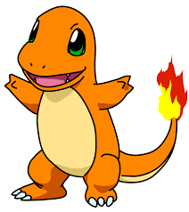

# Facebook AI : *Build AI voice interactions with Wit.ai*
## Pokemon Master : *Gotta talk, and catch 'em all!*


Trapped on an island with your buddy charmander, battle with pokemons and climb up your way to get a master ball, the ultimate ball to get one of the most powerful pokemon on the planet : ***Mewtwo***!

<p align="center">


</p>

Whats fun is that you have to communicate with your pokemon unlike any button or key based interaction. Live in the moment, the battle and win against a variety of wild pokemons. Evolve your Charmander to Charizard! 

<p align="center">


</p>

### Usage

* Clone the repo:
```bash
git clone link-to-repo
```
* Install the dependencies:
```bash
pip install -r requirements.txt
```
* Run the game:
```bash
python game.py
```

### Video Link for demo : [*Click Here*](https://youtu.be/wZEobW0SpMs)


